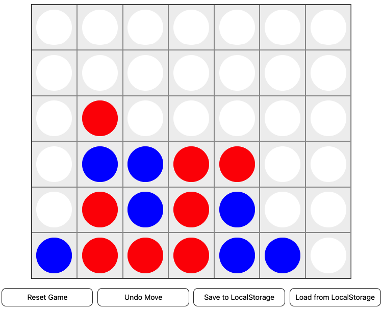

# 4 Gewinnt von Anes Hodza (hodzaane) & Vibishek Rathirajan (rathivib)
Ein simples 4-Gewinnt, welches im Rahmen des WBE Modul an der ZHAW erstellt wurde.


## Developers
- Anes Hodza (hodzaane)
- Vibishek Rathirajan (rathivib)

## Links
- [Live Demo](https://aneshodza.github.io/WBE-Connect-4/)
- [GitHub Repository](https://github.com/aneshodza/WBE-Connect-4)

## Quickstart
Das 4 Gewinnt ist unter
[aneshodza.github.io](https://aneshodza.github.io/WBE-Connect-4/)
im Web zu finden.

### Brew it yourself
Das Projekt kann man sich lokal aufsetzen:
```
git clone <repo-link>   # Repository lokal erhalten
cd WBE-Connect-4

npm i                   # Dependencies installieren
node index.js           # Statischen Server starten

# Jetzt ist die Seite unter localhost:3000 verfügbar
```

## Technische Details
Das Repository is auf [GitHub](https://github.com/aneshodza/WBE-Connect-4) zu finden.
Zusätzlich hat jede Methode JSDocs, welche input und output erklären.

### DOM Manipulation
Das DOM wird mithilfe der `renderSJDON()` Methode manipuliert.
Diese erlaubt eine React-Style Syntax für das rendern des DOM:
```
const DOM = [
    "div"
    { class: 'some-root' },
    ["span", { class: 'some-child' }, "I am a child!"],
    ["h1", { class: 'some-header', "I am a header!"}]
]

// Find this under render.js
renderSJDON(DOM) // <-- This mutates the DOM
```
Dieses wird zum Teil mithilfe von Komponenten "Type-Safe" und wiederverwendbar gemacht:
```
// Find this under components.js
const Board = ({ board }) => {
  const fields = board
    .map((row, rowIdx) =>
      row.map((col, colIdx) => {
        return [Field, { type: col, rowIdx: rowIdx, colIdx: colIdx }];
      }),
    )
    .flat();
  return ["div", { class: "board" }, ...fields];
};

const App = (state) => [Board, { board: state.board }];
```

### DOM Interaktion
Nach dem rendern mit SJDON werden den jeweiligen Elementen mithilfe eines
`getElementById(...)` gefunden und erhalten einen passenden Event Listener mit
`addEventListener(...)`.

### Persistierung des Spielzustandes
Es hat zwei Optionen für die Persistierung: Im LocalStorage und auf einem Server.
#### Remote Server
Falls ein Server erreichbar ist wird das auf diesem Server gespeichert. Der Server
speichert den Spielzustand in eine sqlite Datenbank
#### LocalStorage
Falls unter der Spezifizierten Adresse kein Server gefunden wird, wird der Zustand
unter LocalStorage abgespeichert.

